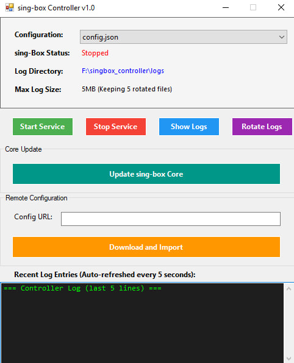
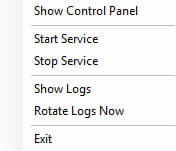

# Sing-box Controller GUI (PowerShell)

[](https://learn.microsoft.com/powershell/)
[](LICENSE)
[](https://github.com/SagerNet/sing-box)


A Windows PowerShell GUI controller for [sing-box](https://github.com/SagerNet/sing-box). It provides a lightweight system tray application to start/stop the service, manage configurations, update the core, and handle log rotation.

-----

## ✨ Features

  - 🖥️ **System Tray GUI**: Easily manage Sing-box from your system tray.
  - 🔄 **Core Updater**: Download the latest version of `sing-box.exe` with a single click.
  - 🌐 **Remote Config Import**: Import configurations from a URL.
  - 📝 **Automatic Log Rotation**: Keeps log files manageable with size and count limits.
  - 📂 **Easy Configuration Switching**: Swap between different local config files effortlessly.

-----

## 🚀 Getting Started

### 1\. Clone the Repository

First, clone this GitHub repository to your local machine:

```sh
git clone https://github.com/bI4ckb34rd/singbox_controller.git
```

Navigate into the newly created directory (`cd singbox_controller`).

### 2\. Install Sing-box Core

Place your `sing-box.exe` binary into the `core` directory.

Alternatively, you can run the script and use the **"Update sing-box Core"** button in the GUI to automatically download the latest version.

### 3\. Run the Controller

Execute the main PowerShell script:

```powershell
.\sing-box.ps1
```

A new icon will appear in your system tray. Right-click it to access the control menu.

-----

## 🖥️ Web UI Dashboard

To access the sing-box dashboard:

1.  Open your web browser and navigate to `http://127.0.0.1:9090`.
2.  In the **Endpoint URL** section, enter `http://127.0.0.1:9090`.
3.  Click **"Add"** to connect to the dashboard.

-----

## 📸 Screenshots

| Main Window | Tray Menu |
|-------------|-----------|
|  |  |

-----

## ⚙️ Configuration

Key settings are configurable at the top of the `sing-box.ps1` script:

| Setting            | Default             | Description                                          |
|--------------------|---------------------|------------------------------------------------------|
| `SingPath`         | `core\sing-box.exe` | Path to the Sing-box core executable.                |
| `SingConfigDir`    | `config`            | Directory where your Sing-box JSON configs are stored. |
| `LogDir`           | `logs`              | Directory for controller and Sing-box logs.          |
| `MaxLogSize`       | `5MB`               | Maximum log file size before rotation.               |
| `MaxLogFiles`      | `5`                 | Number of rotated log files to keep.                 |
| `LogRotationCheck` | `60000`             | Log rotation check interval in milliseconds (ms).    |

-----

## 📂 Project Structure

```
singbox_controller/
├── sing-box.ps1           # Main script (GUI controller)
├── core/
│   └── sing-box.exe       # Sing-box core binary
├── config/                # Your Sing-box JSON configuration files
└── logs/                  # Rotated logs (sing-box.log, controller.log)
```

-----

## 📝 Logs

Logs provide valuable information for debugging and monitoring:

  - **Controller Logs**: `logs\controller.log` (Logs related to the GUI and its operations)
  - **Sing-box Logs**: `logs\sing-box.log` (Logs generated by the Sing-box core itself)

Log rotation runs automatically based on the limits defined in the configuration.

-----

## 🛠 Requirements

  - **Windows PowerShell 5.1** or **PowerShell Core 7+**
  - **.NET Framework** (typically built-in on modern Windows systems)

-----

## 📜 License

This project is licensed under the **GNU General Public License v3.0**. See the `LICENSE` file for more details.

*Note: The Sing-box core is distributed under its own separate license.*

-----

## 📣 Contributing

Contributions are welcome\! Feel free to open an issue to report bugs or suggest features. If you'd like to contribute code, please open a pull request.

## Support This Project

If you find this tool helpful, consider supporting it with a donation!

<a href="https://github.com/bI4ckb34rd/donate/blob/main/README.md" alt="Donate shield">
  
</a>
